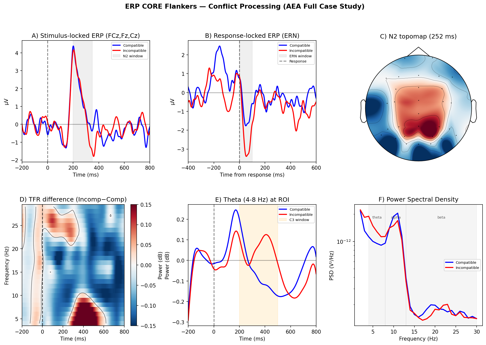

# auto-eeg-analysis (AEA)

AEA is an open library of EEG analysis skills for **MNE-Python**, with executable specifications and a numerically certified core. An agent uses the skills to generate and run analysis code in your environment. EEGLAB and FieldTrip provide independent validation and selected alternative backend paths.

[Getting started](docs/GETTING_STARTED.md) · [Recipe library](recipes/README.md) · [Certification coverage](docs/CERTIFICATION_LEVELS.md) · [Contributing](CONTRIBUTING.md)

## Quick Start

Install Git, Conda, and either Codex CLI or Claude Code first. Run in your terminal:

```bash
git clone https://github.com/dengzhe-hou/auto-eeg-analysis.git
cd auto-eeg-analysis
conda env create -f environment.yml
conda activate aeais
python tools/install_skills.py --agent codex  # or: claude, both
bash tools/env/check_env.sh                  # macOS/Linux; PowerShell in the guide
conda run -n aeais python -m pytest tools/tests/test_skill_apis.py -q
```

The installer links the 22 skills into the selected client's discovery directory
inside this checkout. Start `codex` or `claude` **from the repository root**, with
`aeais` active. Prepare `projects/my-study/raw/` with data matching your chosen
recipe, then enter one of these prompts **inside the client**:

```text
# Codex CLI
$eeg-recipe ern-flankers --data projects/my-study

# Claude Code
/eeg-recipe ern-flankers --data projects/my-study
```

The agent checks your data and asks you to confirm the analysis plan. See
[Getting started](docs/GETTING_STARTED.md) for Windows setup, data layouts, other
agent clients, output locations, and the separate reviewer connection needed for
the audit stage.

## Repository layout

| Directory | Contents |
|---|---|
| [`skills/`](skills/) | The 22 analysis skills read by your agent |
| [`recipes/`](recipes/) | Paradigm-specific analysis specifications and source citations |
| [`templates/`](templates/) | Study documents and selected EEGLAB / FieldTrip backend templates |
| [`tools/`](tools/) | Installation, environment checks, helpers, validation scripts, recorded results, and tests |
| [`projects/`](projects/) | Worked examples with analysis plans, findings, and outputs |
| [`docs/`](docs/) | Setup, platform support, certification coverage, and benchmark documentation |

## Core Architecture

**22 composable skills** (~9,400 lines), distilled from **~85 peer-reviewed methods papers** and **5 practitioner EEG course/handbook collections** — an MNE-Python data-processing handbook, the *《脑电信号处理与特征提取》* (EEG Signal Processing & Feature Extraction) textbook, and three EEGLAB/FieldTrip/MVPA course series (together 165 lecture PDFs / method papers, MNE notebooks, and ~800 reference MATLAB/Python scripts). Organized as plain Markdown files (`SKILL.md`); zero framework dependencies; portable across Claude Code, Codex CLI, Cursor, and other agent platforms.

**Two-model collaboration pattern** (same as ARIS):
- Claude Code: fast, fluid execution (preprocess, ICA, stats, figures)
- gpt-6-astra, max effort (via a fresh Codex CLI process): rigorous, independent EEG-domain critique

## Three Workflows

The slash commands below use Claude Code syntax. In Codex CLI, select the same skill with `$` (for example, `$eeg-recipe`).

| Workflow | Purpose | Entry Skill |
|----------|---------|-------------|
| **W1** | Run a published EEG recipe end-to-end | `/eeg-recipe` |
| **W2** | Custom analysis: define claims, run pipeline | `/eeg-pipeline` |
| **W3** | Pre-submission review by hostile Reviewer 2 | `/eeg-audit` |

### W1: Recipe — reproduce a published analysis

```
/eeg-recipe ern-flankers --data projects/my-study
```

```
auto-brief → eeg-preprocess → eeg-ica → eeg-epoch
  → eeg-erp / eeg-tfr / eeg-spectral
  → eeg-stats → eeg-figure → eeg-methods-text → eeg-audit → REPRO_RECEIPT
```

One command. AEA reads the recipe, auto-detects your data shape, runs 12 stages, and is designed to produce:
- `figure-stage/*.png` (`.svg` when the figure skill emits vector output) — paper-ready figure
- `report-stage/methods.md` — COBIDAS-MEEG methods paragraph *(generated at runtime; not yet committed as a fixture)*
- `audit-stage/AUDIT.md` — Reviewer 2 memo *(generated at runtime; not yet committed as a fixture)*
- `report-stage/REPRO_RECEIPT.md` — reproducibility receipt + citation BibTeX *(`tools/gen_receipt.py` exists; not yet wired into a committed run)*

### W2: Pipeline — custom analysis

```
> "Analyze my attention EEG data in projects/my-study"
```

```
auto-brief → [user fills paradigm + markers + hypothesis]
  → freeze ANALYSIS_PLAN
  → eeg-preprocess → eeg-ica → eeg-epoch
  → eeg-erp / eeg-tfr / eeg-spectral / eeg-connectivity / eeg-decoding
  → eeg-stats → eeg-figure → eeg-methods-text → eeg-audit
```

Same pipeline as W1, but you define the claims instead of using a recipe's pre-defined claims. AEA auto-reads file headers, asks 3–4 questions conversationally, then runs everything.

### W3: Audit — pre-submission review

```
/eeg-audit projects/my-study
Please use adversarial reviewer mode.
```

```
mtime check (machine) → bundle plan + stats + figures
  → Codex CLI (gpt-6-astra, max effort, read-only): "play hostile EEG reviewer"
  → AUDIT.md (pass / pass-with-caveats / revise / fail per claim)
```

Requires the reviewer connection described in [Getting started](docs/GETTING_STARTED.md#w3-audit-an-existing-analysis). Surfaces EEG-specific concerns: cluster threshold not justified, adjacency not reported, bandpass leakage, post-hoc exclusion, channel selection circularity. Fix before Reviewer 2 finds them.

## Skill Map

### Analysis pipeline

```
eeg-preprocess → eeg-ica → eeg-epoch ──┬── eeg-erp
                                        ├── eeg-tfr
                                        ├── eeg-spectral
                                        ├── eeg-decoding
                                        ├── eeg-connectivity
                                        ├── eeg-microstate
                                        ├── eeg-complexity
                                        └── eeg-source
                                              │
                                     eeg-stats ← (all branches)
                                              │
                              eeg-figure → eeg-methods-text → eeg-report → eeg-audit
```

| Skill | What it does | Evidence level |
|-------|--------------|----------------|
| `eeg-preprocess` | Filter, re-ref, bad channels, RANSAC, ICA-rank arithmetic | L3 |
| `eeg-ica` | ICA + ICLabel, extended Infomax, `find_bads_*` selection | L0 |
| `eeg-epoch` | Segmentation, AutoReject, fixed-length (resting) | L3 |
| `eeg-erp` | Condition averaging, mean amplitude, fractional area latency | L3 |
| `eeg-tfr` | Morlet, multitaper, STFT, Hilbert, ERDS, ITC | L0 |
| `eeg-stats` | Cluster permutation, FDR, `f_mway_rm`, design routing, Cohen's d | L3 (cluster test) |
| `eeg-figure` | Publication figures, connectivity & source panels, raincloud | L1 |
| `eeg-spectral` | PSD (Welch/multitaper), specparam/FOOOF, IAF, 1/f slope | L2 |
| `eeg-decoding` | MVPA, temporal generalization, subject-wise CV, CSP | L0 |
| `eeg-behavior` | RT/accuracy, single-trial EEG-behavior (mixed-effects) | L0 |
| `eeg-connectivity` | wPLI, PLV, coherence, Granger, time-resolved, graph + NBS | L0 |
| `eeg-microstate` | Modified k-means (pycrostates), GEV, transition probabilities | L0 |
| `eeg-complexity` | Lempel-Ziv, sample/permutation entropy, RQA, 1/f criticality, Hilbert-Huang | L0 |
| `eeg-source` | dSPM, sLORETA, eLORETA, LCMV/DICS beamformer | L0 |
| `eeg-bids` | Raw → BIDS-EEG conversion (mne-bids) | L0 |
| `eeg-qc` | Data-quality dashboard: SNR, LOF/line-noise, rejection rates, pass/warn/fail gates | L0 |
| `eeg-group-compare` | Between/within-group cluster perm, mixed/RM ANOVA, effect sizes, forest plots | L0 |
| `eeg-methods-text` | Auto COBIDAS-MEEG paragraph from logs | L1 |
| `eeg-audit` | Cross-model reviewer (gpt-6-astra), EEG-specific checks | L1 |
| `eeg-report` | HTML report + REPRO_RECEIPT.md | L0 |
| `eeg-pipeline` | Top-level orchestrator, crash recovery, timing | L0 |
| `eeg-recipe` | Run recipe end-to-end, version tracking, quality gates | L0 |

Each skill includes domain knowledge, an MNE-Python code path, failure modes, and COBIDAS reporting requirements.

The levels above follow the existing [certification record](docs/CERTIFICATION_LEVELS.md):
**L3** is cross-toolbox numerical certification, **L2** is cross-implementation
numerical certification, **L1** is behavioural evaluation, and **L0** is interface
or API testing. Each level applies to the outputs and configurations listed in
that record, rather than every operation a skill describes. The catalogue has
4 skills at L3, 1 at L2, 3 at L1, and 14 at L0.

Committed evidence includes both the original single-subject demonstrations and
later group validations. See [tools/validation/](tools/validation/) for validation
results and [tools/benchmark/](tools/benchmark/) for numerical comparisons.

## Recipe Library

Each recipe = one published EEG analysis, made executable. The recipe IS the paper's method section as a Markdown file.

| Recipe | Paradigm | Source | Available evaluation |
|--------|----------|--------|--------|
| `n170-face-inversion` | N170 upright vs inverted faces | Rossion et al. 2003 | experimental |
| `p300-oddball` | P300 to rare targets | Polich 2007 | **validated** (N=20 group, ERP CORE P3) |
| `alpha-attention-cueing` | Posterior alpha desync | Worden et al. 2000 | experimental |
| `ern-flankers` | ERN + N2 + frontal theta | Kappenman 2021 / Gehring 1993 | **validated** (N=1 full recipe + N=14 group ERN) |
| `mmn-oddball` | Auditory MMN (deviant − standard) | Näätänen 2007 | **validated** (N=38 group) |
| `n170-faces` | N170 face selectivity (face − non-face) | Bentin 1996 / Wakeman 2015 | **validated** (N=16 ds000117 + N=20 ERP CORE) |
| `n400-semantic` | N400 semantic priming (unrelated − related) | Kutas 2011 | **validated** (N=20 group, ERP CORE N400) |
| `resting-microstate` | Resting microstates A–D + temporal dynamics | Michel & Koenig 2018 | **validated** (N=20) |
| `resting-spectral-connectivity` | Resting PSD + 1/f + wPLI connectivity (EC vs EO) | Donoghue 2020 / Vinck 2011 | **validated** (N=20) |
| `complexity-anesthesia` | Complexity/entropy tracking of arousal & anesthetic depth | Schartner 2015 / Zhang 2001 | **validated** (sanity, N=20) |

The [recipe catalogue](recipes/README.md#available-recipes) lists each recipe's declared status separately from the available evaluation above. For example, `p300-oddball` still declares `experimental` while recording group-validation results. The three continuous recipes declare `validated`; their dataset-specific evidence and limitations are recorded in their recipe files.

[Contribute a recipe or skill](CONTRIBUTING.md) — significant contributors are invited as co-authors on the AEA paper.

## Case Study: Full Pipeline on Real EEG Data

**ERP CORE Flankers** (Kappenman et al. 2021) — BioSemi 30ch, 1024Hz. 3 pre-registered claims, Bonferroni corrected. **94.6 seconds** from raw to publication figure.

> Scope: this is a **single-subject (N=1)** demonstration (ERP CORE Subject-001) — 2 of 3 pre-registered claims were supported. It shows the pipeline runs end-to-end and is reproducible; it is **not** group-level evidence. Separate group validations are now available in the recipe library above; they do not change the N=1 scope of this demonstration.

<p align="center">
  
</p>

| Claim | Result | Effect |
|-------|--------|--------|
| C1: Incompatible N2 > Compatible (stim-locked) | not supported (Bonferroni) | N=1 limitation |
| C2: Incompatible ERN > Compatible (resp-locked) | **supported** | d = −0.23 |
| C3: Theta power conflict effect (TFR) | **supported** | d = 0.20 |

```
Pipeline: auto-brief → eeg-preprocess → eeg-ica(ICLabel, 6 rejected)
  → eeg-epoch(stim: 393, resp: 390) → eeg-erp(N2 + ERN)
  → eeg-tfr(theta) → eeg-spectral(PSD) → eeg-stats(3 claims, 5000 perms)
  → eeg-figure(6 panels) → eeg-methods-text → REPRO_RECEIPT
```

Also validated: MNE sample data (auditory N100), with full audit loop (FAIL → fix 9 issues → PASS-WITH-CAVEATS).

## How AEA Relates to Other Tools

```
AEA = ARIS architecture + EEG domain expertise (22 skills, ~85 papers + 5 course/handbook collections)
      ↓ generates code for ↓
      MNE-Python (computation)
```

- **AEA is to MNE what HuggingFace Transformers is to PyTorch** — a high-level layer of shareable, validated, domain-specific recipes. *(Empirically: 5 recipe specs — run as reference implementations, harmonized *minimal* pipelines — match MNE-BIDS-Pipeline across 5 ERP CORE components and **both** epoching modes: MMN (N=38, CCC 0.9997), P3, N170, response-locked ERN, N400 — all within ±0.1 µV/subject, CI-gated. See [docs/BENCHMARK.md §5](docs/BENCHMARK.md) for exact scope.)*
- **AEA is to ARIS what a domain-specific model is to a foundation model** — same architecture, specialized knowledge.

| | AEA | MNE-Python | MNE-BIDS-Pipeline |
|---|---|---|---|
| What it is | Methodology + recipes | Computation library | Config pipeline |
| You write | Natural language | Python | 200-line YAML |
| Output | Figure + methods + audit | Arrays | Intermediate files |
| Replaces it? | No — uses it underneath | — | — |

## Roadmap

| Phase | Status |
|-------|--------|
| 0. Scaffolding (20 skills, 7 recipes, ~5,940 lines) | ✅ Done |
| 1. End-to-end validation + audit loop + full case study | ✅ Done |
| 2. Skill breadth (spectral, decoding, behavior, connectivity, microstate, source, **complexity**) + distillation from EEG course/handbook collections | ✅ Done |
| 3. Recipe library (20+ paradigms, 5 external contributors) | Planned |
| 4. Community (hero video, conference posters, Scientific Data Article) | Planned |

[Getting started](docs/GETTING_STARTED.md) · [Certification coverage](docs/CERTIFICATION_LEVELS.md) · [Benchmarks](docs/BENCHMARK.md) · [Comparison](docs/COMPARISON.md)

## License

[MIT](LICENSE)

## Acknowledgements

Architecture from [ARIS](https://github.com/wanshuiyin/Auto-claude-code-research-in-sleep) by [@wanshuiyin](https://github.com/wanshuiyin). Recipe library inspired by HuggingFace's model hub.
