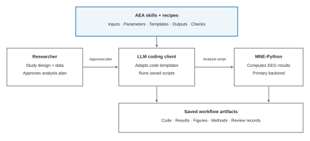
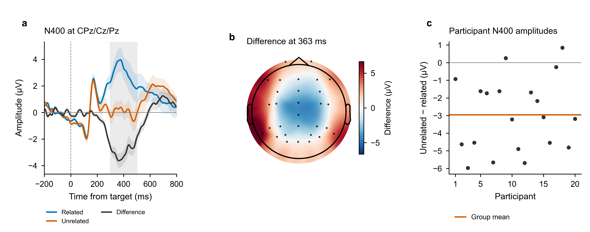

# AEA

EEG analysis skills for **MNE-Python**, with executable specifications and a numerically certified core.

**22 skills · 10 recipes · Codex CLI / Claude Code**

Your agent generates and runs analysis code in your environment. Outputs include figures, COBIDAS-MEEG methods text, an audit report, and a reproduction receipt.

[Website](https://dengzhe-hou.github.io/auto-eeg-analysis/) · [Getting started](docs/GETTING_STARTED.md) · [Recipes](recipes/README.md) · [Latest release](https://github.com/dengzhe-hou/auto-eeg-analysis/releases/latest)

[](docs/assets/library-overview.svg)

Skills and recipes specify the analysis; you approve the plan, the agent adapts the code, and MNE-Python produces inspectable outputs.

## Quick start

Install Git, Conda, and a signed-in Codex CLI or Claude Code client first.

```bash
git clone https://github.com/dengzhe-hou/auto-eeg-analysis.git
cd auto-eeg-analysis
conda env create -f environment.yml
conda activate aeais
python tools/install_skills.py --agent codex
```

Start `codex` from this directory with `aeais` active. With compatible data in `projects/my-study/raw/`, enter this **inside the client**:

```text
$eeg-recipe ern-flankers --data projects/my-study
```

For Claude Code, install with `--agent claude`, start `claude`, and use `/eeg-recipe` instead of `$eeg-recipe`.

Confirm the analysis plan before execution. The audit stage needs a [configured reviewer](docs/GETTING_STARTED.md#configure-the-reviewer). The [setup guide](docs/GETTING_STARTED.md) covers Windows, data formats, custom pipelines, and output files.

## N400 example

[](docs/assets/n400-example.png)

Saved results from 20 ERP CORE participants: CPz/Cz/Pz ERPs with ±1 participant SEM, a descriptive difference scalp map, and each participant's 300–500 ms amplitude difference. [Run, inspect, and replay this example](docs/EXAMPLES.md#erp-core-complete-n400-recipe-case).

## Validation

Certification applies to the outputs and configurations in the [coverage record](docs/CERTIFICATION_LEVELS.md). EEGLAB and FieldTrip provide independent comparisons and selected alternative backend paths. Each [recipe](recipes/README.md#available-recipes) records its status and available evaluation.

[Benchmark record](https://github.com/dengzhe-hou/auto-eeg-analysis/blob/995f53d42cc74205b164e8711d4b289b8c2ad3a1/docs/BENCHMARK.md) · [Worked examples](docs/EXAMPLES.md) · [Contributing](CONTRIBUTING.md) · [Citation](CITATION.cff)

Software uses the [MIT licence](LICENSE); recipe metadata uses CC BY 4.0. Built on [ARIS](https://github.com/wanshuiyin/Auto-claude-code-research-in-sleep).
